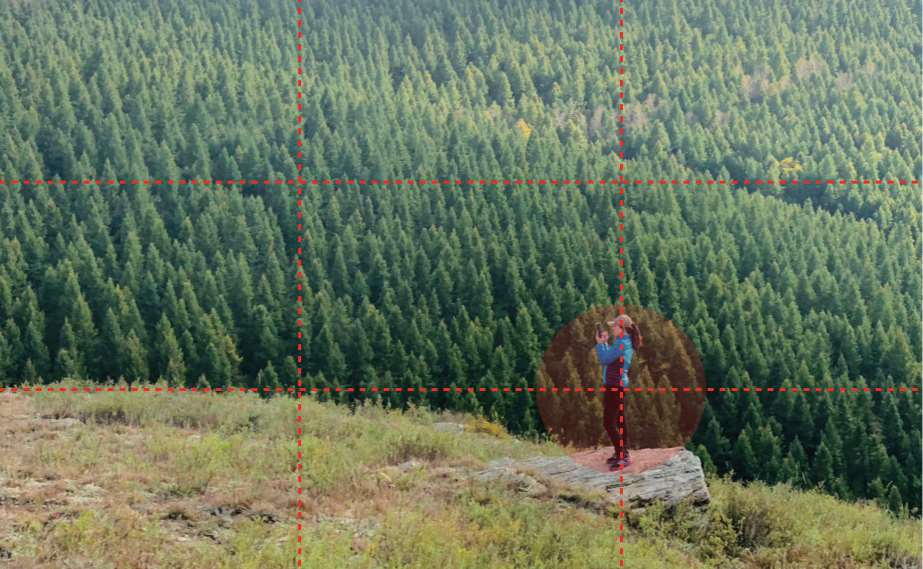
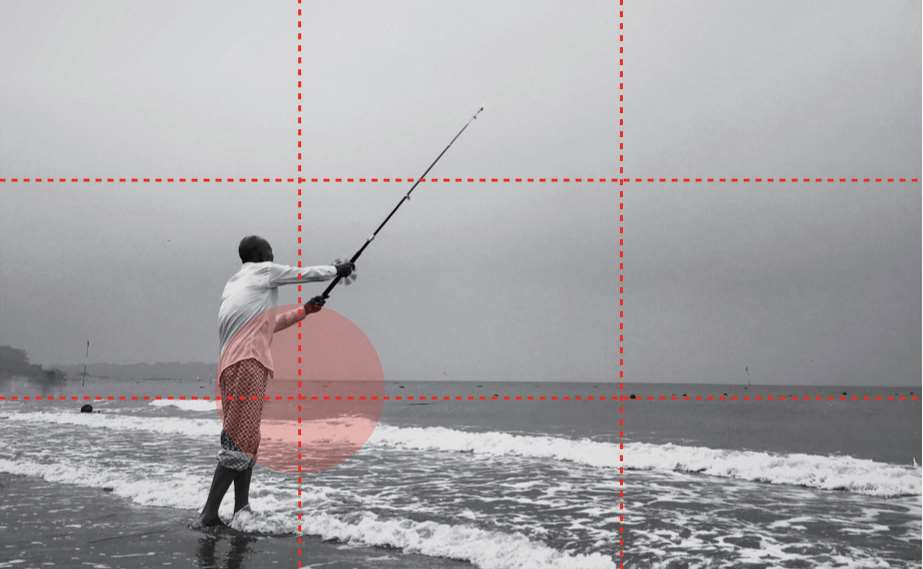
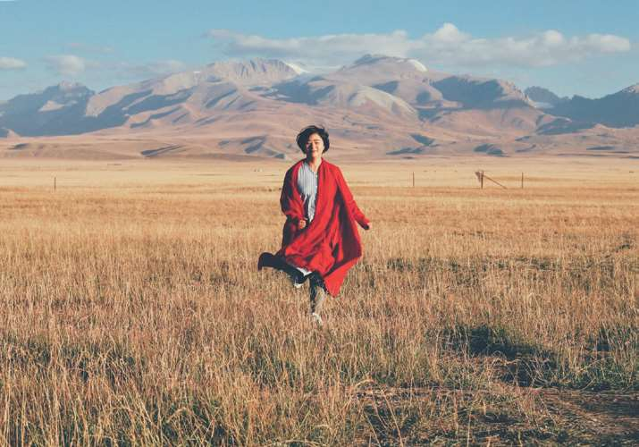

这本书的书名叫《拿起手机，人人都是摄影师：卷毛佟的手机摄影笔记》。
很多人应该对摄影多少有点感兴趣，我也不例外，所以想稍微学学摄影，这样给老婆大人拍照就不会被嫌弃了，也可以更好地记录生活中的美好瞬间，出去玩耍看到漂亮的风景想拍摄时，希望能环节力不从心的窘境。
而选择手机作为入门工具，首要的原因当然是穷；另外我也不喜欢对什么事情刚刚有点兴趣时，就急着购买专业的工具的搞法；此外，手机厂商最近几年仍然在卷影像功能，兴许我手里这千元机，也能达到五年前旗舰机的水平呢。
废话不多说了，本文记录作者分享的一些摄影知识。

## 摄影基础
- 对焦，拍照时要根据想表达的主题，来确定画面的焦点，要保证焦点位置成像清晰。对焦是保证画面清晰度的基本因素。手机自动对焦有时会出现对焦不准的情况，可以通过手动点击画面焦点来对焦。
- 曝光，用来控制进光量，曝光过度的照片会显得白茫茫一片，曝光不足则会导致照片太暗，看不清细节，点击屏幕出现对焦框后，可以上下滑动小太阳图标来控制曝光程度。
- 辅助线，打开手机相机的辅助线，可以保证照片画面横平竖直，这对于入门很有帮助，此外有些场景需要横平竖直才能体现其特点，如气势恢宏的古建筑、地平线、海平面等。
- 景深，拍人像等照片时，通过控制景深可以让人物清晰，背景模糊。景深受光圈大小、焦距影响，但手机镜头一般是固定的，此时可以让拍摄主体离背景远一点，镜头离主体近一点，就可以实现景深效果；而且现在的手机都是多个摄像头，会提供人像、大光圈模式，借助多个摄像头和算法，可以实现景深效果。
- HDR，可以在逆光时拍出更好的效果，使用HDR时，手机会自动拍摄三张照片，一张过曝，一张欠曝，一张正常，然后把三张照片合成为一张，HDR可以有效地优化大光比场景，让画面的明暗对比更自然，过渡更自然。

## 构图
构图是为了合理组织画面中的元素，使人、景、物构成一个协调的画面。
- 九宫格构图，九宫格中间的四个交点处于近似黄金分割的位置，拍摄时把主体放在其中的某一个点上。九宫格比较适合记录人和环境的关系。

- 中心构图，画面结构简单，左右均衡，容易突出主体，特别适合人像、静物摄影。
