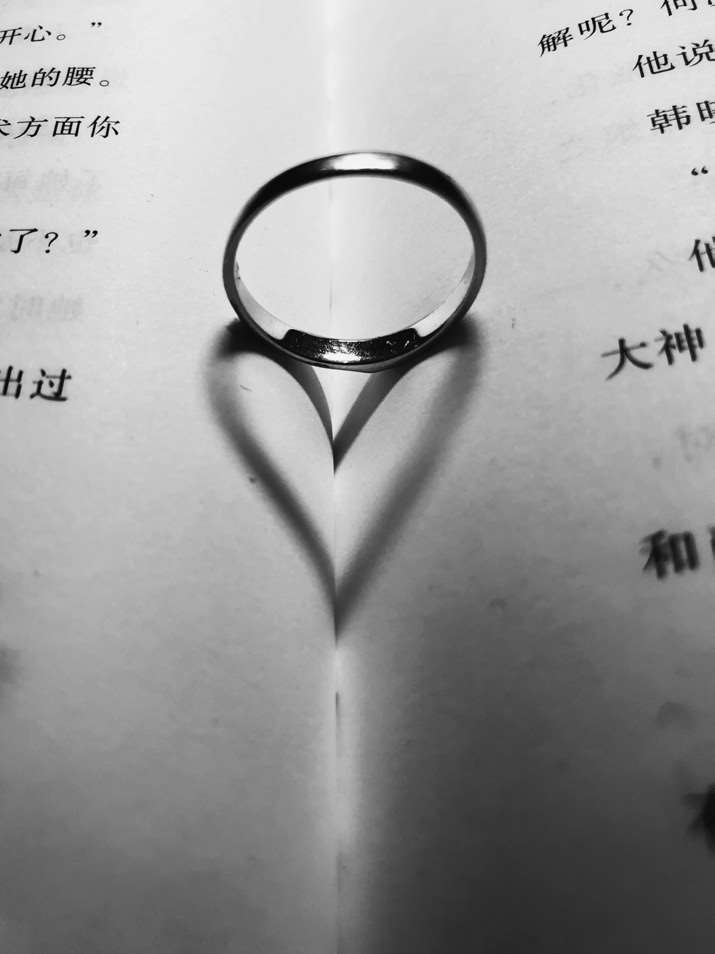

这本书的书名叫《拿起手机，人人都是摄影师：卷毛佟的手机摄影笔记》。
很多人应该对摄影多少有点感兴趣，我也不例外，所以想稍微学学摄影，这样给老婆大人拍照就不会被嫌弃了，也可以更好地记录生活中的美好瞬间，玩耍时看到漂亮的风景想拍摄时，希望能环节力不从心的窘境。
而选择手机作为入门工具，首要的原因当然是穷；另外我也不喜欢对什么事情刚刚有点兴趣时，就急着购买专业工具的搞法；此外，手机厂商最近几年仍然在卷影像功能，兴许我手里这千元机，也能达到五年前旗舰机的水平呢。
废话不多说了，本文记录作者分享的一些摄影知识。

## 摄影基础
- 对焦，拍照时要根据想表达的主题，来确定画面的焦点，要保证焦点位置成像清晰。对焦是保证画面清晰度的基本因素。手机自动对焦有时会出现对焦不准的情况，可以通过手动点击画面焦点来对焦。
- 曝光，用来控制进光量，曝光过度的照片会显得白茫茫一片，曝光不足则会导致照片太暗，看不清细节，点击屏幕出现对焦框后，可以上下滑动小太阳图标来控制曝光程度。
- 辅助线，打开手机相机的辅助线，可以保证照片画面横平竖直，这对于入门很有帮助，此外有些场景需要横平竖直才能体现其特点，如气势恢宏的古建筑、地平线、海平面等。
- 景深，拍人像等照片时，通过控制景深可以让人物清晰，背景模糊。景深受光圈大小、焦距影响，但手机镜头一般是固定的，此时可以让拍摄主体离背景远一点，镜头离主体近一点，就可以实现景深效果；而且现在的手机都是多个摄像头，会提供人像、大光圈模式，借助多个摄像头和算法，可以实现景深效果。
- HDR，可以在逆光时拍出更好的效果，使用HDR时，手机会自动拍摄三张照片，一张过曝，一张欠曝，一张正常，然后把三张照片合成为一张，HDR可以有效地优化大光比场景，让画面的明暗对比更自然，过渡更自然。

## 构图
构图是为了合理组织画面中的元素，使人、景、物构成一个协调的画面。
- 九宫格构图，九宫格中间的四个交点处于近似黄金分割的位置，拍摄时把主体放在其中的某一个点上。九宫格比较适合记录人和环境的关系。

- 中心构图，画面结构简单，左右均衡，容易突出主体，特别适合人像、静物摄影。

- 三角形构图，画面中的主体具备三角形轮廓，或者相关的主要元素可以形成一个三角形，显得画面稳定，使用这种构图法上，三个物体之间最好有大小、远近、主次之分。

- 对称构图，上下、左右、对角都可以形成对此构图，会显得画面均衡稳定，给人一种肃穆、宁静感。特别适合拍摄大型建筑物、水面倒影，拍摄时画面一定要摆正。

- 框架式构图，利用物体形成的框架构成前景，把主体放到框架中，显得画面场景丰富，有层次感。

- 留白构图，留白可以更好地突出主体，给观者更多地想象空间。主体之外，尽量少地保留其它元素，而且主体地位置一般更靠近边缘。

>摄影是减法，因为即使你的镜头角度再广，也没办法把你看到的所有内容拍进去。所以要抓重点。

有时一张照片可以同时应用多种构图方式，不管如何构图，目的都是为了更好地突出主体，让人明白自己想表达地内容。

## 光线
摄影是光影的艺术，拍摄就是捕捉光，后期处理的一部分内容则是调整光在照片的强度和发布。
用手机拍摄，没有专业的灯光设备、拍摄环境，多数时候要利用自然光拍摄，既然没办法控制光线，就要学会利用它。

- 顺光，也叫平面光，光照面积较大，拍出的主体很清楚，色泽鲜艳；但缺点是没有了明暗对比，缺少细节、立体感。
- 逆光，典型如日出日落，手机无法很好地处理这类场景，曝光容易过度或不足，此时可以拍摄剪影来刻画主体地轮廓，需要手动调节曝光。拍剪影要注意最好选择干净的背景，如天空。
- 侧光，可以在主体上形成明显的明暗对比，显得有立体感，如早晨、傍晚时，光线角度低且柔和，但如果室外光线太强，会导致明暗过渡不自然，就可以利用窗边的侧光。
- 顶光，如中午的阳光、天花板的灯光，拍人像会导致脸部轮廓的凸起留下阴影，人物可以做一些抬头、遮挡阳光等动作，如果拍建筑则无法利用影子体现立体感，无能为力，尽量“起早、贪黑”，利用好日出、日落的黄金一小时。
- 闪光灯，

## 视角
同一个场景，视角不同，产生的效果也相差很大。
- 水平，镜头和主体保持水平角度，这种视角画面显得比较庄重、严肃，一般会配合对称或中心构图，与人们正常观察的角度一致，比较有代入感；缺点是画面中规中矩，有点直白。
- 仰拍，拍人物时，将手机放在人的腰部或膝盖的高度仰拍，可以利用透视原理，排除大长腿，这种视角也适合拍建筑、大树、山峰等；在游人如织的景区，仰拍可以避开人群。此外低角度由于不同于平常的视角，画面会很新颖，比如拍地上的落叶，可以把手机倒过来，让镜头离地面更近。

- 俯拍，拍摄景物时，高角度俯拍可以拍出更广的场景；还有自拍时的万金油视角，即斜上方45度；拍摄食物可以正上方或斜45度。

>一个摄影师在拍照之前，脑子里需要有一个成型的照片的样子，拍摄只是实现你想法的一个过程，而不是在拍摄的过程中，边想边拍.
>前期可以从模仿开始，模仿自己喜欢的作品的拍摄方法、拍摄思路。

## 场景
摄影是一个发现美、记录美的过程，它不仅仅考验一个人的技术，也考验一个人的想法。我们要培养一种能力，在习以为常的环境中发现不一样的美。

- 倒影，只要有积水的地方，就可以利用倒影来对称构图，倒放手机效果更好; 拍摄倒影后，还可以将照片旋转180度，使倒影成为主体，以营造一种朦胧的效果。使用这种技法时，因为效果类似剪影，所以要注意保持背景的简单。

- 镜面，利用城市里随处可见的玻璃幕墙，可以拍出有趣的照片，另外利用小镜子、另一个手机也可以制造镜面效果。

>摄影不要被各种条条框框局限制思维。我们学习的是原理，是思路

- 夜景，两个时段，落山后一小时，此时天空颜色丰富；还有全黑后，此时更多拍摄的是建筑物的光效、路上的车水马龙。手机有夜景或者流光快门模式，使用时最好配置三脚架。另外也可以“追焦”拍摄，拿稳手机，让镜头随着主体移动，同时按下快门，选择灯光丰富的场景效果更好。

## 黑白照片
俗话说“效果不够，黑白来凑”，普通的照片调成黑白，效果立马就出来了，但黑白照片不仅仅是加个滤镜那么简单。
黑白是永恒的经典，是由繁至简的过程，去掉多余色彩的干扰，可以让人看到另一个世界。

>好的作品一定是很好地利用了光线，特别是黑白照片，对于光线的要求会更高，无论是自然光还是人造光

>在黑白摄影中，没有色彩来强调细节，只能靠光线来突出主题。

**适合拍黑白照的场景：**
- 有影子的地方，要学会抓住光影，学会观察，有些平淡的场景，加入阴影后画面会变得手动起来，手机拍摄前可以设置滤镜。

- 有趣的图案，影子会睡着光线的强弱、角度不同而变化，多观察，总会有意外的收获，手机摄影的好处就在于：发现有趣的场景时，可以随手记录，不需要高超的摄影技巧，只需要足够的创意。

- 有强光的地方，强光会留下浓重的阴影，早晚时段的光线能产生强烈的阴影；或者通过物体的遮挡，也能同样的效果。

- 有人的地方，有人存在的照片，人自然而然会成为关注的焦点，可以远距离拍摄景物，通过小人和大景的对比增加画面空间感。

- 有线条的地方，比如有规则线条、秩序性比较好的建筑，黑白色调更能体现其特点。

**如何利用手机拍摄独特的黑白照**
手机无法像相机那样有很好的明暗过渡分界线，无法优化处理更多的画面信息，夜拍画质也不行，不过这些缺点都可以通过黑白照片进行适当的弥补。

- 光影对比，黑白照片只有黑白灰三种颜色，黑白是主要颜色，灰色做过渡，拍摄时选择强光影环境，在画面中增加黑白对比，还可以通过降低曝光、后期处理来实现。

- 选择极简环境，黑白照片中的元素如果太多，会显得杂乱，因为本来却没有颜色的衬托，主体更容易被环境覆盖。

- 关注纹理细节，黑白照片由于屏蔽了颜色的干扰，特别容易表现纹理质感。

